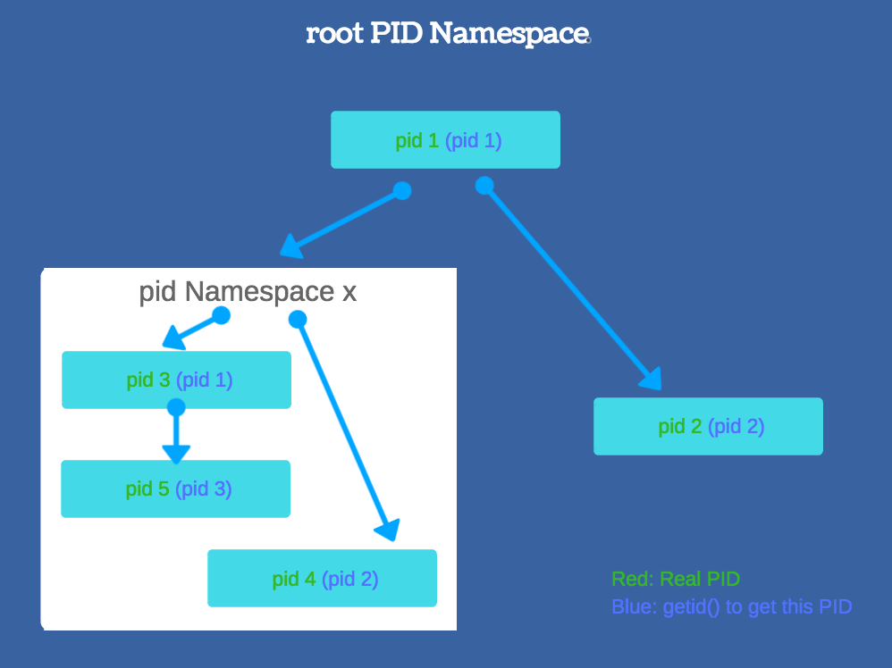
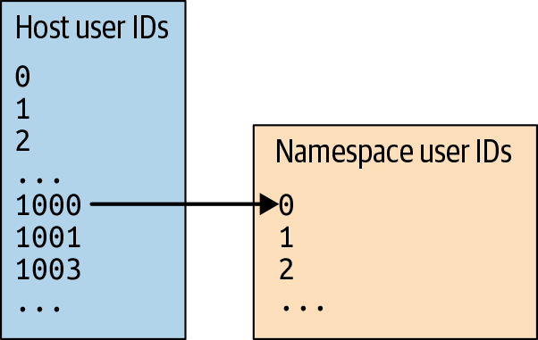

# Namespace
- Namespaces are a feature of the Linux kernel that partitions kernel resources such that one set of processes sees one set of resources while another set of processes sees a different set of resources.
- There are many types of namespace: 
    - Mount (mnt)
    - [Process ID (pid)](#isolate-the-ProcessID)
    - [Network (net)](#isolate-the-network)
    - Interprocess Communication (ipc)
    - [UNIX Timesharing System (uts)](#isolate-the-hostname)
    - [User ID (user)](#isolate-the-user)
    - Control group (cgroup) : available from March 2016 in Linux 4.6.
    - Time: available from March 2020 in Linux 5.6. [[ref]](https://lwn.net/Articles/779104/)
- Some namespaces can be nested.
- List all namespaces in the system with `lsns`:
```console
$ lsns
        NS TYPE   NPROCS   PID USER COMMAND
4026531835 cgroup      3  5205 hqt  /lib/systemd/systemd --user
4026531836 pid         3  5205 hqt  /lib/systemd/systemd --user
4026531837 user        3  5205 hqt  /lib/systemd/systemd --user
4026531838 uts         3  5205 hqt  /lib/systemd/systemd --user
4026531839 ipc         3  5205 hqt  /lib/systemd/systemd --user
4026531840 mnt         3  5205 hqt  /lib/systemd/systemd --user
4026531993 net         3  5205 hqt  /lib/systemd/systemd --user
```
- Illustration of a namespace:
# 


# Examples
**unshare** : run program with some namespaces unshared from parent

Examples will go through the `unshare` command to show how does the `unshare` can be used to isolate namespaces from the parent.

### Isolate the Hostname
Allow a single system to appear to have different host and domain names to different processes.

Running `unshare` command with the `--uts` flag.

```console
# run the "sh" program with the uts namespace is isolated
hqt@localhost:~$ sudo unshare --uts sh
$

# hostname will be inherited from the parent shell
$ hostname
localhost

# change the host name
$ hostname github
github

# exit the "sh" program
$ exit

# run again the hostname command. original hostname does not change
hqt@localhost:~$ hostname
localhost
```

### Isolate the ProcessID
- Provide processes with an independent set of process IDs from other namespaces.
- Can be nested
- Running `unshare` command with the `--pid` flag.

```console
hqt@localhost:~$ sudo unshare --pid sh
$

# whoami
root

# whoami
sh: 2: Cannot fork

# whoami
sh: 3: Cannot fork
```

We can only call the command `whoami` only once. Any subsequence calls have the format: `sh: [process_id] : Cannot fork`.
The reason because of the `unshare` command only affects for the first child process forked.

```console
hqt@localhost:~$ ps fa
  PID TTY      STAT   TIME COMMAND
 5302 pts/0    Ss     0:00 -bash
10376 pts/0    S      0:00  \_ sudo unshare --pid sh
10377 pts/0    S+     0:00      \_ sh
```

We should use `--fork` to specify the forked application as a child process of `unshare` than running it directly.

```console
hqt@localhost:~$ sudo unshare --pid --fork sh
$

# whoami
root

# whoami
root
```

We can test again on the other terminal on the host environment:
```console
hqt@localhost:~$ ps fa                                                 
  PID TTY      STAT   TIME COMMAND
 5302 pts/0    Ss     0:00 -bash
11554 pts/0    S      0:00  \_ sudo unshare -f --pid sh
11555 pts/0    S      0:00      \_ unshare -f --pid sh
11556 pts/0    S+     0:00          \_ sh
```
"sh" process now is the child of "unshare" command.

**Process isolation**

Even though the new shell has its own process namespace, the result of "ps" command still show the process of the whole system:
```console
hqt@localhost:~$ sudo unshare --pid --fork sh
$

ps -eaf
# long list of processes
```

- The reason because "ps" command works by reading the virtual files from `/proc`. 
- In order to have `ps` only returns the process inside the namespace as Docker did, we need to isolate the `/proc` directory from the host system.
- We need to have the separate copy of the `/proc` directory. Because `/proc` is under the root, we need to change the root directory by using [chroot command](CHROOT.md)

The following is the list of commands need to setup a new filesystem based on the alpine:
```console
hqt@localhost:~$ mkdir alpine && cd alpine
hqt@localhost:~/alpine$ curl -o alpine.tar.gz http://dl-cdn.alpinelinux.org/alpine/v3.10/releases/x86_64/alpine-minirootfs-3.10.0-x86_64.tar.gz
hqt@localhost:~/alpine$ tar xvf alpine.tar.gz
hqt@localhost:~/alpine$ cd ..
```

After we all set up the environment, we will change the new root path into the new alpine directory and run the `unshare` command from this:
```console
hqt@localhost:~$ sudo unshare --pid --fork chroot alpine sh
$

# command line mount -t [type] [device] [dir]
$ mount -t proc proc proc
```

Now the `ps` command only shows just the processes inside the process id namespace:

```console
$ ps
PID   USER     TIME  COMMAND
    1 root      0:00 sh
    6 root      0:00 ps
```

To summarize, the steps will be:
- Setup the new file system included basic command lines such as sh / mount / ...
- Start the new process ID namespace with the command `unshare`
- Change the root into the new created file system by using the command `chroot`
- Change the mount point by using the command `mount`

### Isolate the User
- Provide both user and privilege isolation and user across multiple sets of processes 
- Running `unshare` command with the `--user` flag.

```console
hqt@localhost:~$ unshare --user bash
nobody@localhost:~$ 

nobody@localhost:~$ id
uid=65534(nobody) gid=65534(nogroup) groups=65534(nogroup)

# get the current process
nobody@localhost:~$ echo $$
19255

# get all linux capacities
nobody@localhost:~$ capsh --print | grep Current
Current: =
```

We can map from the host's user id to the namespace's user id
# 

The mapping exists in `/proc/<pid>/uid_map`. So we try to map with the following command:

```bash
# mapping user namespace's root (id = 0)  to the host  user and only map 1
sudo echo '0 [host_user_id] 1' > /proc/[namespace_process_id]/uid_map
```

On the host terminal, assuming the running user is "1000", the user namespace's process is 19255:
```console
hqt@localhost:~$ echo '0 1000 1' > /proc/19255/uid_map 
```
On the user namespace's terminal:
```console
nobody@localhost:~$ id
uid=0(root) gid=65534(nogroup) groups=65534(nogroup)

# There are more capacities
nobody@localhost:~$ capsh --print | grep Current
# list of capacties
```

When we create a process with multiple namespaces, the user namespace will be created first.
```console
hqt@localhost:~$ unshare --uts sh
unshare: unshare failed: Operation not permitted

hqt@localhost:~$ unshare --uts --user sh
$ 
```

### Isolate the Network
